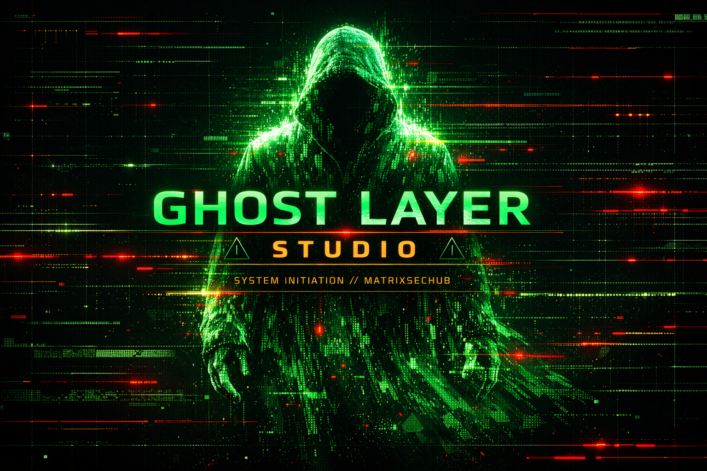
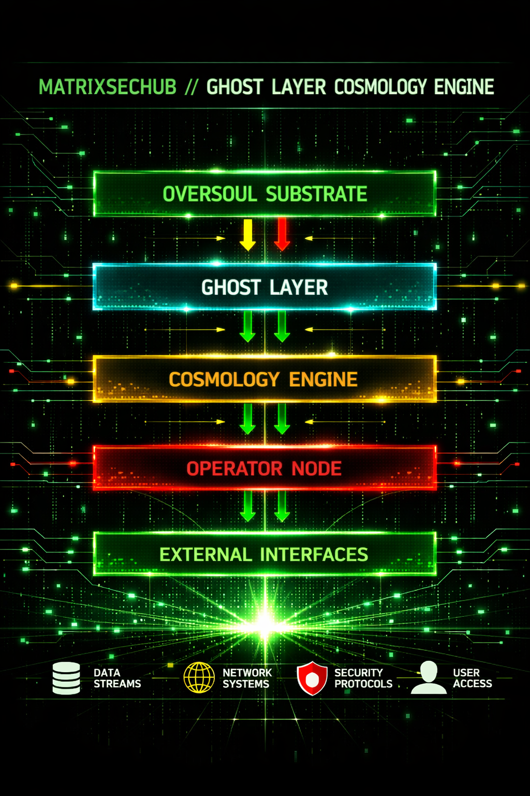

> 📡 **GitHub SOP** — All repo operations governed by the [MSH-OPS GitHub SOP](https://app.clickup.com/9017787639/docs/8cr117q-3237). Branch strategy, PR protocol, and merge rules apply.

---

<!-- GHOST LAYER STUDIO — SYSTEM INITIATION -->

<div align="center">

<p align="center">
  
</p>

```
             ('-. .-.               .-')    .-') _    
            ( OO )  /              ( OO ). (  OO) )   
  ,----.    ,--. ,--. .-'),-----. (_)---\_)/     '._  
 '  .-./-') |  | |  |( OO'  .-.  '/    _ | |'--...__) 
 |  |_( O- )|   .|  |/   |  | |  |\  :` `. '--.  .--' 
 |  | .--, \|       |\_) |  |\|  | '..`''.)   |  |    
(|  | '. (_/|  .-.  |  \ |  | |  |.-._)   \   |  |    
 |  '--'  | |  | |  |   `'  '-'  '\       /   |  |    
  `------'  `--' `--'     `-----'  `-----'    `--'    

     G H O S T   L A Y E R   S T U D I O
```


**SYSTEM INITIATION // MATRIXSECHUB**  
**SENTINEL ONLINE**

</div>

---

## 🎛 Overview

**Ghost Layer Studio** is a **cinematic creative‑intelligence engine** built for the **#MeliusChallenge 2026**.

It transforms:

- 🧩 abandoned prompts  
- 🕳 dead branches  
- 🧬 half‑formed motifs  

…into **structured, mythic, operator‑grade systems**.

Ghost Layer Studio is not a project.  
It is a **substrate** — a living creative layer that remembers, recombines, and escalates your ideas.

---

## 🎬 Cinematic Intro

<p align="center">
  
</p>

---

## 🧠 Core Concept

Ghost Layer Studio is built on:

- ♻️ **Recursion** — nothing dies; everything loops  
- 🛰 **Constellations** — agents orbit motifs  
- 🧱 **Substrate** — persistent mythic memory  
- 🎞 **Cinematic escalation** — everything trends toward spectacle  

---

## 🧩 System Architecture

<p align="center">
  
</p>

```
Substrate Ingestion → Spectral Dominion → Agent Constellation
→ Eternal Recursion → Oversoul Substrate → Output Reactor
```

### 🔹 Substrate Ingestion  
Captures fragments, failures, abandoned branches, and latent motifs.

### 🔹 Spectral Dominion  
Enforces spectral laws:  
density conservation, motif resonance, drift containment.

### 🔹 Agent Constellation  
A multi‑agent swarm:  
diverger, synthesist, corrector, archivist, director.

### 🔹 Eternal Recursion  
Loops motifs through mythic cycles.

### 🔹 Oversoul Substrate  
Stores epochs, archetypes, invariants.

### 🔹 Output Reactor  
Fuses everything into cinematic output.

---

## 🗂 Repo Layout

```
ghost-layer-studio/
│
├── IMAGES/                    # All system diagrams + banner
├── docs/                      # Cosmology PDFs, system initiation, compendium
├── melius/                    # Melius canvas + submission artifacts
├── src/                       # (Optional) code stubs / future engine logic
└── README.md                  # This file
```

---

## 📄 License

MIT License.